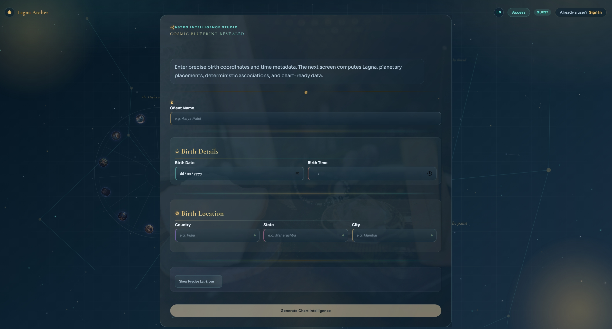
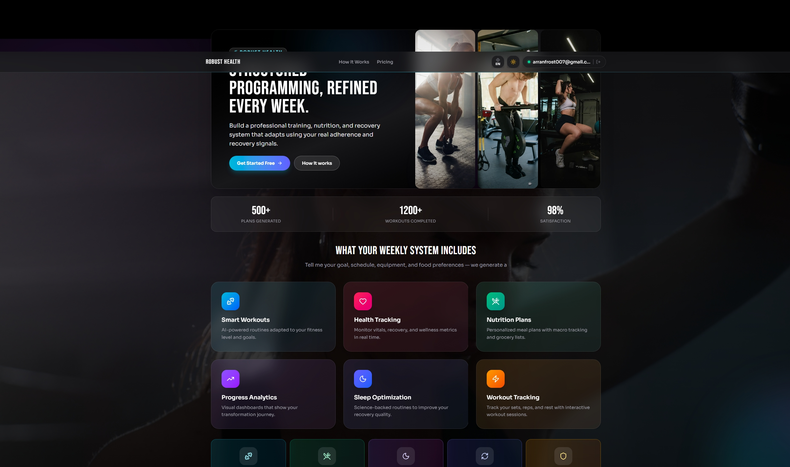
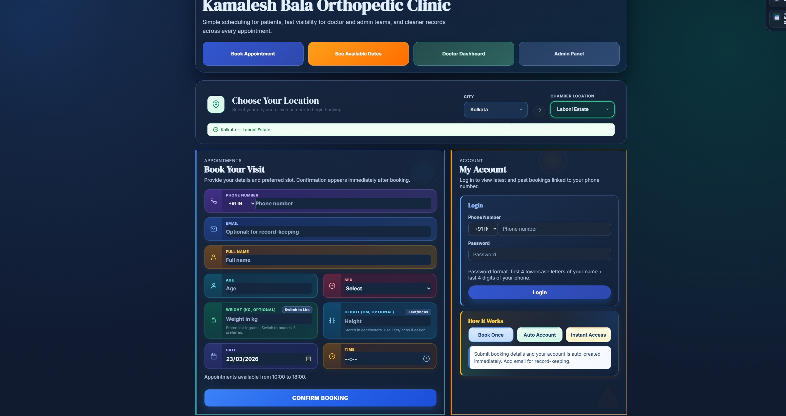
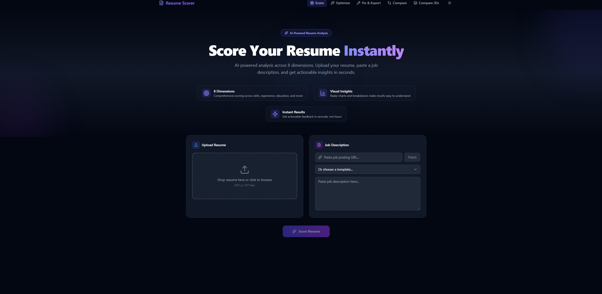

<h1 align="center">Hey, I'm Swapnanil 👋</h1>

  <b>Builder · Data Scientist · Full-Stack Developer</b> 
  <i>M.S. Data Science — Khoury College of Computer Sciences, Northeastern University</i>

  
  

---

## 🧭 About Me

I'm a data science grad student who actually ships real-world systems.

My work sits at the intersection of:

- ⚡ Applied Machine Learning
- 🏗 Backend Systems
- 🌐 Full-Stack Product Development

I don’t just build models — I build products people use.

Outside of code: 🏍 motorcycles, 💪 lifting, 🎹 piano, and 🌌 astrophysics.

---

## 🚀 Live & Deployed Projects

### 🌌 Astro App

Cross-platform astrology platform with chart generation, palm reading, and AI-powered interpretations.

**Tech:** `React Native` `TypeScript` `FastAPI` `Supabase`  
👉 [Live App](https://large-astro-web-app.vercel.app/)

---

### 💪 Robust Health App

Full-scale fitness system with workout tracking, meal planning, and dynamic training workflows.

**Tech:** `Next.js` `TypeScript` `Supabase` `Vercel`  
👉 [Live App](https://app.robusthealth.in/)

---

### 🏥 Appointment Booking Platform

Production-grade medical booking system with scheduling, prescriptions, and WhatsApp notifications.

**Tech:** `Next.js` `Supabase` `Neon` `Twilio`  
👉 [Live App](https://drbalaortho.com/)

---

### 📄 Resume AI Platform

AI-powered resume analyzer, job scorer, optimizer, and cover letter generator with intelligent feedback.

**Tech:** `Next.js` `FastAPI` `LLMs` `Vercel`  
👉 [Live App](https://resume-handler-kappa.vercel.app/)

---

## 📐 Academic & Portfolio Projects

### 🎮 GridWorld Search Visualizer
Visual comparison of BFS, DFS, UCS, A*, and Bidirectional Search with performance metrics.

**Tech:** `Python` `Pygame`

---

### 📊 BRFSS Health Dashboard
Interactive dashboard analyzing chronic health indicators with demographic breakdowns.

**Tech:** `R` `Shiny`

---

### 🧠 TikTok Copyright Analyzer
End-to-end NLP pipeline for detecting copyright risk signals using multiple ML models.

**Tech:** `Python` `NLP` `scikit-learn`

---

### 🍋 Little Lemon Database System
Fully normalized relational database with advanced queries and stored procedures.

**Tech:** `SQL`

---

### 🧹 Room Cleanliness Detector
Computer vision model (~90% accuracy) for classifying room cleanliness.

**Tech:** `Python` `Computer Vision`

---

## 🧰 Skills & Stack

| Domain | Technologies |
|---|---|
| **Languages** | Python, TypeScript, JavaScript, SQL, R |
| **Frontend** | Next.js, React Native, Tailwind CSS |
| **Backend** | FastAPI, Node.js |
| **Databases** | Supabase, PostgreSQL, Neon |
| **ML & Data** | scikit-learn, PyTorch, XGBoost, NLP, CV |
| **Mobile** | React Native (Expo) |
| **Deployment** | Vercel, Render |
| **Tools** | Git, GitHub, VS Code, Jupyter |

---

## 📚 Resources

Check out my notes repository for practical learning built from real-world usage.

---

## ⚡ Philosophy

> I don’t just write code — I build systems that people actually use.
