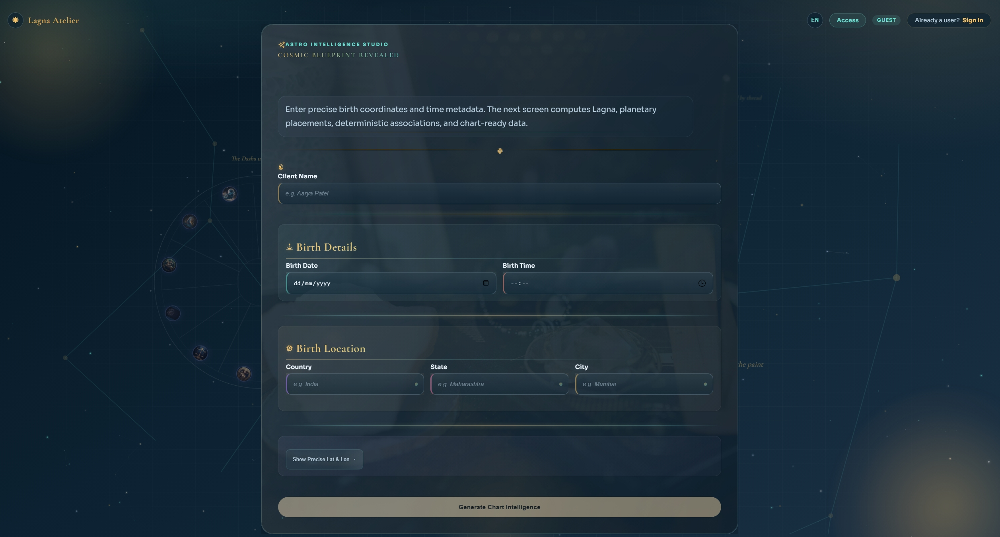
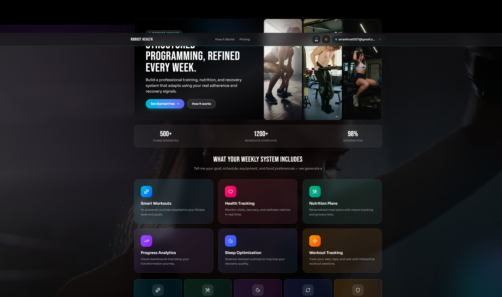
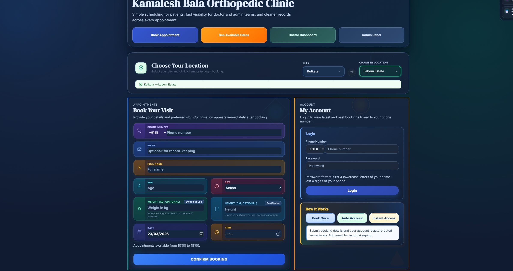
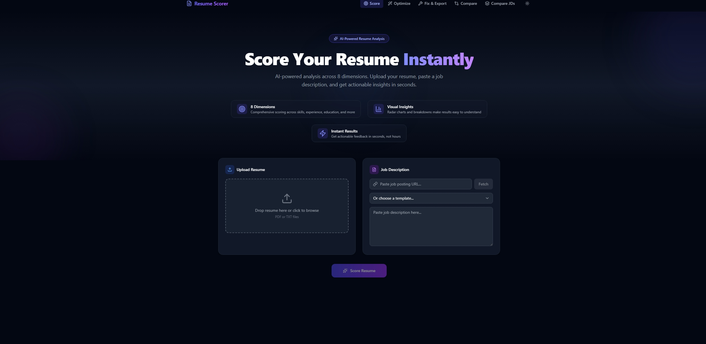

<h1 align="center">Hi, I'm Swapnanil</h1>

  M.S. Data Science — Khoury College of Computer Sciences, Northeastern University

  
  

---

## About Me

I'm a data science grad student who spends most of his time building things and figuring out why they broke.

My work tends to sit somewhere across:
- Applied Machine Learning
- Backend Systems
- Full-Stack Development

When I'm not at a screen: motorcycles and the gym.

---

## Live Projects

### Astro App

Cross-platform astrology platform with chart generation, palm reading, and AI-powered interpretations.

**Tech:** `React Native` `TypeScript` `FastAPI` `Supabase`
👉 [Live App](https://large-astro-web-app.vercel.app/)

---

### Robust Health App

Fitness app with workout tracking, meal planning, and training workflows.

**Tech:** `Next.js` `TypeScript` `Supabase` `Vercel`
👉 [Live App](https://app.robusthealth.in/)

---

### Appointment Booking Platform

Medical booking system with scheduling, prescriptions, and WhatsApp notifications.

**Tech:** `Next.js` `Supabase` `Neon` `Twilio`
👉 [Live App](https://drbalaortho.com/)

---

### Resume AI Platform

Resume analyzer and optimizer — scores against job descriptions and generates cover letters.

**Tech:** `Next.js` `FastAPI` `LLMs` `Vercel`
👉 [Live App](https://resume-handler-kappa.vercel.app/)

---

## Academic & Portfolio Projects

### GridWorld Search Visualizer
Visual comparison of BFS, DFS, UCS, A*, and Bidirectional Search with performance metrics.
**Tech:** `Python` `Pygame`

---

### BRFSS Health Dashboard
Interactive dashboard exploring chronic health indicators across demographic groups.
**Tech:** `Python` `Plotly`

---

### TikTok Copyright Analyzer
NLP pipeline for detecting copyright risk signals using multiple ML models.
**Tech:** `Python` `NLP` `scikit-learn`

---

### Little Lemon Database System
Normalized relational database with stored procedures and complex queries.
**Tech:** `SQL`

---

### Room Cleanliness Detector
Computer vision classifier for room cleanliness, ~90% accuracy.
**Tech:** `Python` `Computer Vision`

---

## Stack

| Domain | Technologies |
|---|---|
| **Languages** | Python, TypeScript, JavaScript, SQL, R, Julia, C++ |
| **Frontend** | Next.js, React Native, Tailwind CSS |
| **Backend** | FastAPI, Node.js |
| **Databases** | Supabase, PostgreSQL, Neon, SQLite, MySQL Workbench, BeeKeeper Studio, MongoDB Atlas, PocketBase, Turso |
| **ML & Data** | scikit-learn, PyTorch, XGBoost, NLP, CV, Linear Regression, Logistic Regression, MANCOVA, ANACOVA, Statistical Analysis |
| **Deployment** | Vercel, Render, Railway |
| **AI & Dev Tools** | Claude Code, OpenAI Codex, Windsurf, Cursor, Blackbox AI, Ollama |
| **Tools** | Git, GitHub, VS Code, Jupyter |
| **API** | OPENAI_API, claude_api, Ably_API, Resend_API |

---

## Resources

Notes I've put together from actual usage — nothing theoretical:
[Pandas Essentials & NumPy Basics](https://github.com/SwapnanilBala/Pandas_Essentials_and_Numpy_Basics)

---

## How I work

I care more about whether something actually works than whether it looks impressive on paper.
