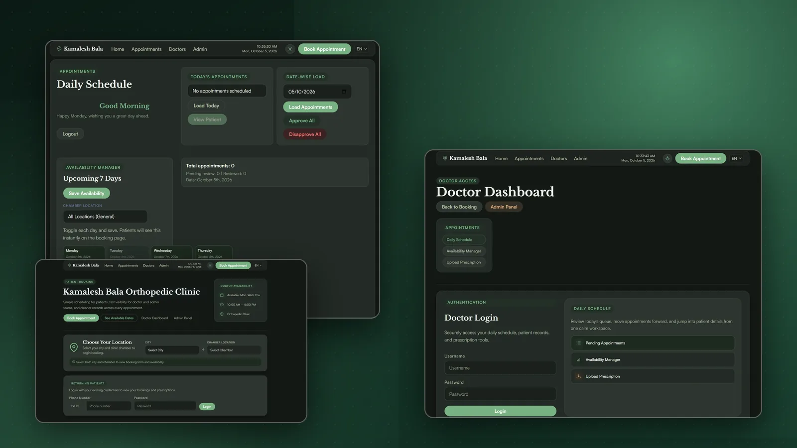
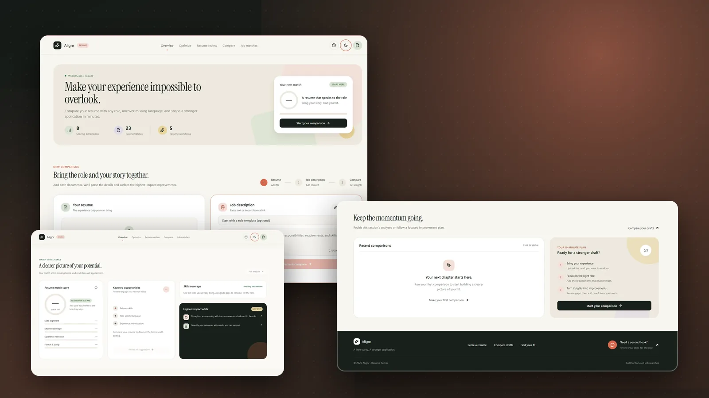

  <picture>
    <source media="(prefers-color-scheme: light)" srcset="assets/banner-light.svg">
    
  </picture>

  Data science grad student at Northeastern who loves building things people actually use. 
  <!--live-->4<!--/live--> live apps so far, plus NLP, vision and search projects.

  M.S. Data Science — Khoury College of Computer Sciences, Northeastern University

  
  

  <a href="#featured-work">Featured work</a> ·
  <a href="#academic--portfolio-projects">Academic</a> ·
  <a href="#stack">Stack</a> ·
  <a href="#resources">Resources</a> ·
  <a href="https://swapportfolio.vercel.app">Portfolio ↗</a>

## About Me

I'm a data science grad student who spends most of his time building things and figuring out why they broke.

My work tends to sit somewhere across:
- Applied Machine Learning
- Backend Systems
- Full-Stack Development

I care more about whether something actually works than whether it looks impressive on paper.

When I'm not at a screen: motorcycles and the gym ([@frost.plays.lifts](https://www.instagram.com/frost.plays.lifts/)).

## Featured Work

Click a card for the full gallery of every screen.

<!-- featured:start -->
<table>
<tr>
<td width="50%" valign="top">
  
  <h3>Lagna Atelier</h3>
  
Vedic astrology engine: birth charts across six ayanamshas and six house systems, dasha timelines, yoga detection and AI palm reading.

  
1,863 tests · 23 divisional charts · 51 yogas detected

  
<code>Next.js</code> <code>TypeScript</code> <code>astronomy-engine</code> <code>Neon + Drizzle</code> <code>Claude vision</code>

  
<a href="https://lagnaatelier.site/"><b>Live app ↗</b></a> · <a href="https://github.com/SwapnanilBala/Large_Astro_Web_App">Code</a> · <a href="projects/lagna-atelier.md">Gallery · 7 screens</a>

</td>
<td width="50%" valign="top">
  
  <h3>Robust Health</h3>
  
Fitness PWA that turns a member&#x27;s profile into weekly training, nutrition and sleep plans, with separate member and trainer portals.

  
15 training programmes · 160+ exercises · −50% web load time

  
<code>Next.js</code> <code>TypeScript</code> <code>Supabase</code> <code>Claude API</code> <code>Vercel</code>

  
<a href="https://app.robusthealth.in/"><b>Live app ↗</b></a> · <a href="projects/robust-health.md">Gallery · 8 screens</a>

</td>
</tr>
<tr>
<td width="50%" valign="top">
  
  <h3>Appointment Booking Platform</h3>
  
Booking system for a live orthopedic clinic: patient booking, the doctor&#x27;s daily schedule, an admin panel and WhatsApp notifications.

  
3 portals: patient, doctor, admin · 7-day availability view

  
<code>Node.js</code> <code>Express</code> <code>PostgreSQL</code> <code>Twilio</code>

  
<a href="https://drbalaortho.com/"><b>Live app ↗</b></a> · <a href="projects/appointment-booking.md">Gallery · 3 screens</a>

</td>
<td width="50%" valign="top">
  
  <h3>Alignr</h3>
  
Resume analyzer: scores a resume against a job description across eight weighted dimensions, compares drafts and ranks up to ten job posts.

  
8 scoring dimensions · 23 role templates · Parses PDF, DOCX, TXT and TEX

  
<code>Next.js</code> <code>TypeScript</code> <code>Python</code> <code>Neon</code>

  
<a href="https://resume-handler-kappa.vercel.app/"><b>Live app ↗</b></a> · <a href="projects/alignr.md">Gallery · 3 screens</a>

</td>
</tr>
</table>
<!-- featured:end -->

## Academic & Portfolio Projects

<!-- academic:start -->
| Project | What it does | Stack | Links |
|---|---|---|---|
| **Fake News Classifier** | DistilBERT vs RoBERTa vs a TF-IDF baseline on LIAR political claims; best validation macro-F1 0.558, +0.033 over TF-IDF. | `Python` `PyTorch` `Transformers` | [Code](https://github.com/SwapnanilBala/Fake-News-Classifier) |
| **GridWorld Search Visualizer** | Watch BFS, DFS, DLS, UCS, A* and bidirectional search run on grid maps, with expanded-node and frontier metrics. | `Python` `Pygame` | [Code](https://github.com/SwapnanilBala/Grid_Game_With_Multiple_SA) |
| **TikTok Claims Classifier** | Classifies TikTok videos as claims or opinions at ~99.5% recall. Google Advanced Data Analytics capstone. | `Python` `scikit-learn` `XGBoost` | [Code](https://github.com/SwapnanilBala/Tik-Tok) |
| **BRFSS Health Dashboard** | Interactive dashboard of CDC BRFSS health indicators by demographic group, with confidence intervals and yearly trends. | `Python` `Plotly Dash` `pandas` | [Code](https://github.com/SwapnanilBala/BRFSS_Dash_App) |
| **CIFAR-10 Image Classifier** | Small convolutional network trained from scratch on CIFAR-10's 50,000 images, evaluated every epoch on the 10,000-image test set. | `Python` `PyTorch` | [Code](https://github.com/SwapnanilBala/Pytorch_Beginner_Image_Classification) |
| **Little Lemon Database System** | Meta Database Engineer capstone: a normalized MySQL schema with stored procedures and complex queries. | `SQL` `MySQL` | [Code](https://github.com/SwapnanilBala/Little_Lemon_Data_base_Plus_Auto_Prescription_App) |
<!-- academic:end -->

## Stack

| Area | Tools |
|---|---|
| **Languages** |  |
| **Web** |  |
| **Data & ML** |  |
| **Databases** |  |
| **Deploy & Tools** |  |

<b>Full list</b>

| Domain | Technologies |
|---|---|
| **Languages** | Python, TypeScript, JavaScript, SQL, R, Julia, C++ |
| **Frontend** | Next.js, React Native, Tailwind CSS |
| **Backend** | FastAPI, Node.js |
| **Databases** | Supabase, PostgreSQL, pgvector, Neon, SQLite, MySQL, MongoDB Atlas, PocketBase, Turso |
| **ML & Data** | scikit-learn, PyTorch, Hugging Face Transformers, XGBoost, pandas, NumPy |
| **Methods** | NLP, computer vision, RAG systems, linear & logistic regression, MANCOVA, ANCOVA, hypothesis testing, data visualization |
| **Deployment** | Vercel, Render, Railway |
| **AI & Dev Tools** | Claude Code, OpenAI Codex, Cursor, Ollama |
| **Tools** | Git, GitHub, VS Code, Jupyter, Antigravity, MySQL Workbench, Beekeeper Studio |
| **APIs** | OpenAI API, Claude API, Ably, Resend |

## Resources

Notes I've put together from actual usage — nothing theoretical:
[Pandas Essentials & NumPy Basics](https://github.com/SwapnanilBala/Pandas_Essentials_and_Numpy_Basics)
