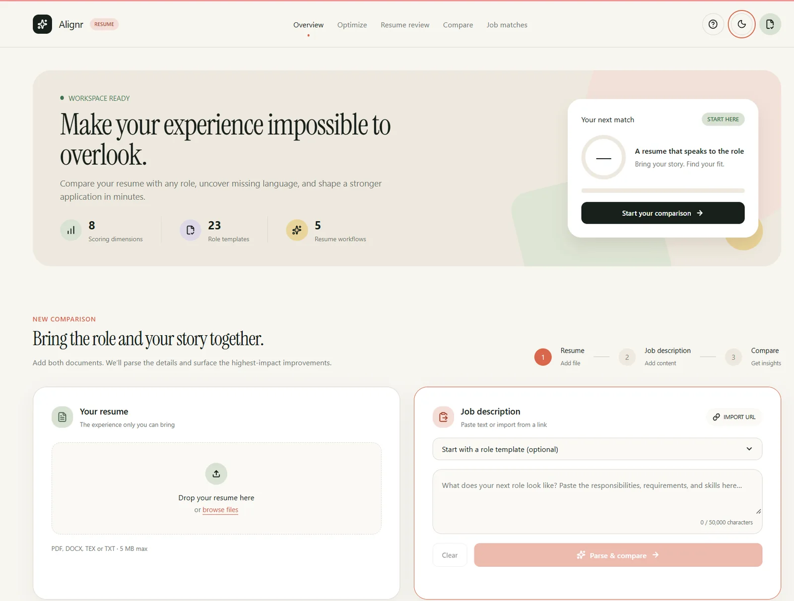
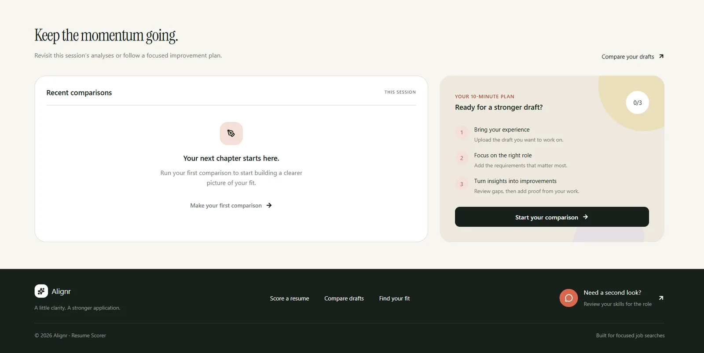
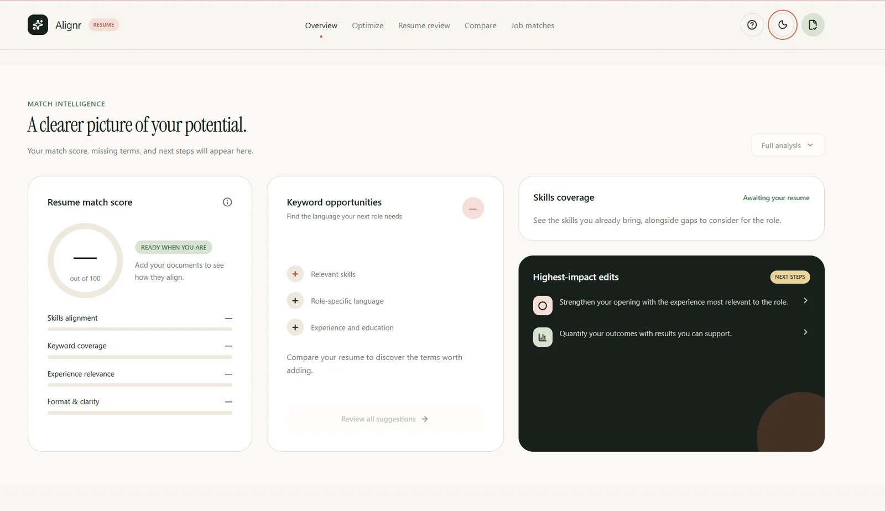

<!-- generated by scripts/build.py from data/projects.toml - edit the manifest, not this file -->

[← Back to profile](../README.md#featured-work)

# Alignr

**Score a resume against any job description**

Resume analyzer: scores a resume against a job description across eight weighted dimensions, compares drafts and ranks up to ten job posts.

**8 scoring dimensions** · **23 role templates** · **Parses PDF, DOCX, TXT and TEX**

**Stack:** `Next.js` `TypeScript` `Python` `Neon`  
**Live:** [resume-handler-kappa.vercel.app](https://resume-handler-kappa.vercel.app/)

## Screenshots (3)

<table>
<tr>
<td align="center" valign="top"> Overview: start a comparison with a resume and a job description</td>
</tr>
</table>

<table>
<tr>
<td align="center" valign="top" width="50%"> Workspace: recent comparisons and a ten-minute improvement plan</td>
<td align="center" valign="top" width="50%"> Match intelligence: resume score, keyword opportunities, skills coverage and top edits</td>
</tr>
</table>

---

[← Appointment Booking Platform](appointment-booking.md) · [All projects](../README.md#featured-work)
