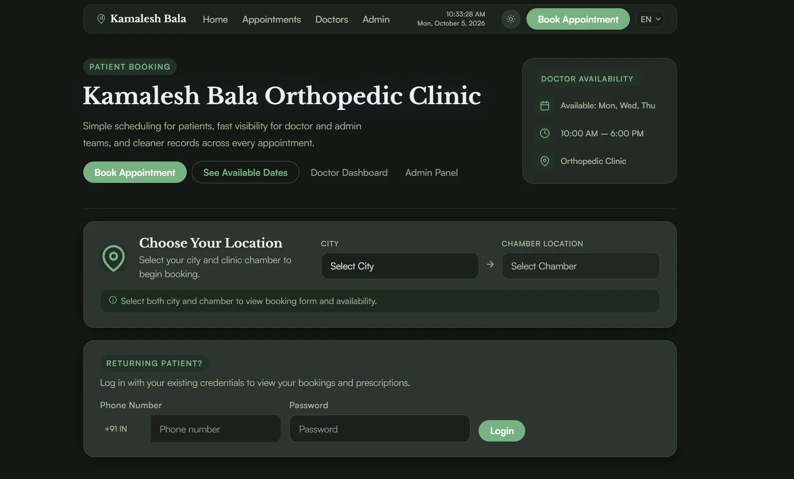
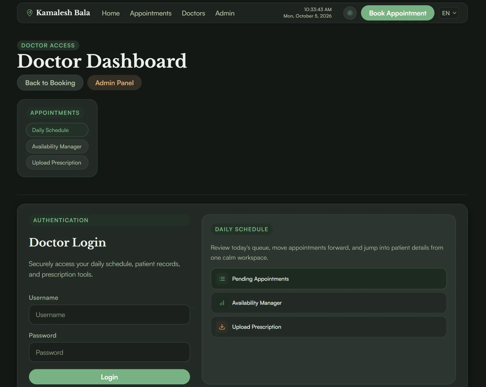
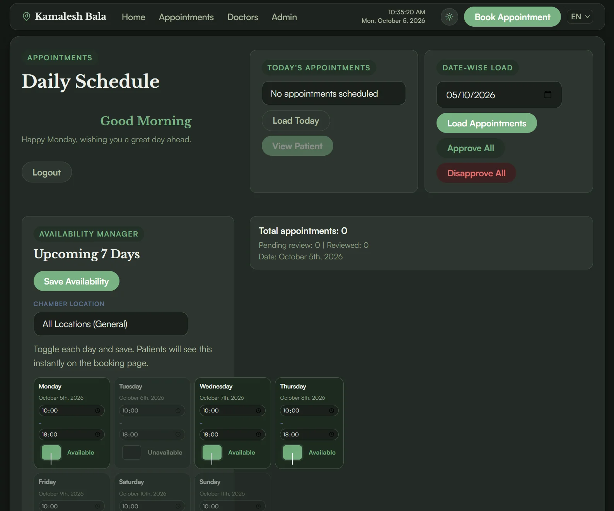

<!-- generated by scripts/build.py from data/projects.toml - edit the manifest, not this file -->

[← Back to profile](../README.md#featured-work)

# Appointment Booking Platform

**Booking, scheduling and prescriptions for a live orthopedic clinic**

Booking system for a live orthopedic clinic: patient booking, the doctor's daily schedule, an admin panel and WhatsApp notifications.

**3 portals: patient, doctor, admin** · **7-day availability view**

**Stack:** `Node.js` `Express` `PostgreSQL` `Twilio`  
**Live:** [drbalaortho.com](https://drbalaortho.com/)

## Screenshots (3)

<table>
<tr>
<td align="center" valign="top" width="50%"> Patient booking home: choose a city and chamber, or log in as a returning patient</td>
<td align="center" valign="top" width="50%"> Doctor dashboard login: schedule, availability and prescription tools</td>
</tr>
</table>

<table>
<tr>
<td align="center" valign="top"> Daily schedule and availability manager: toggle the days patients can book</td>
</tr>
</table>

---

[← Robust Health](robust-health.md) · [All projects](../README.md#featured-work) · [Alignr →](alignr.md)
