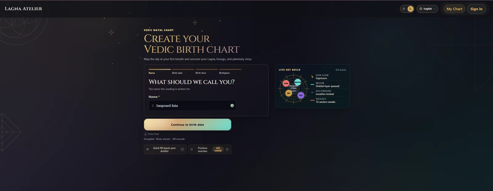
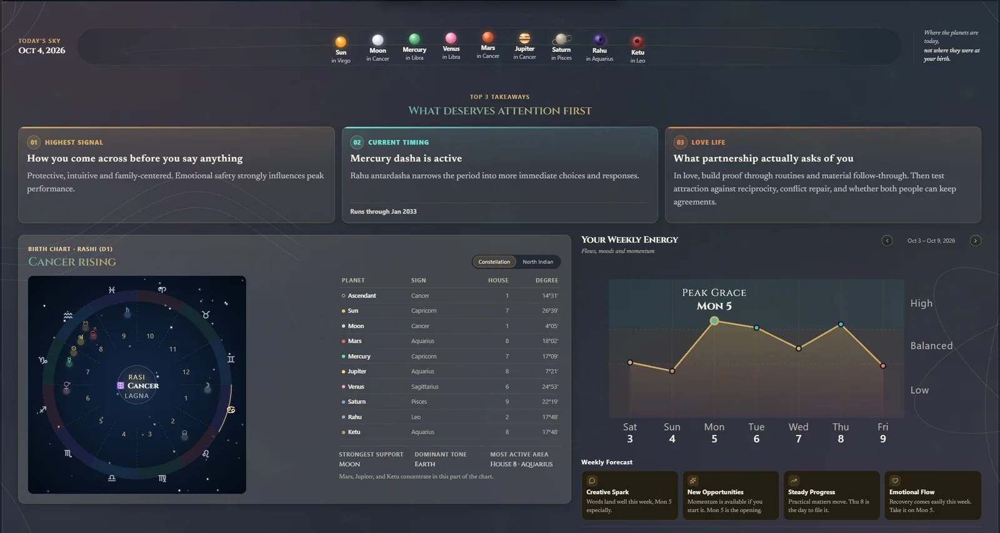
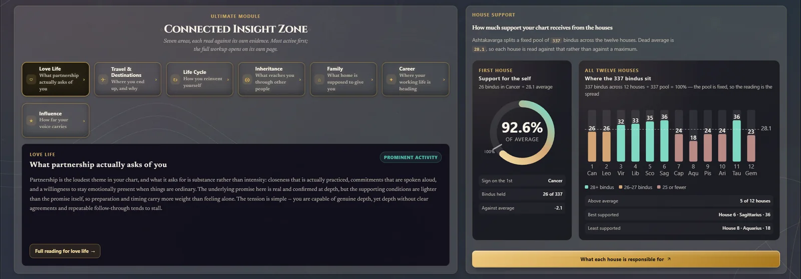
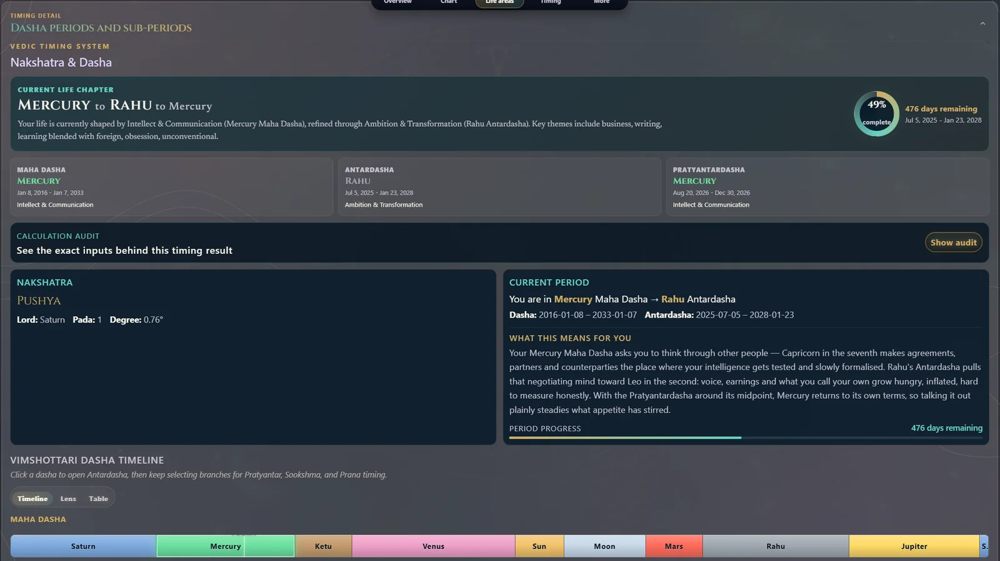
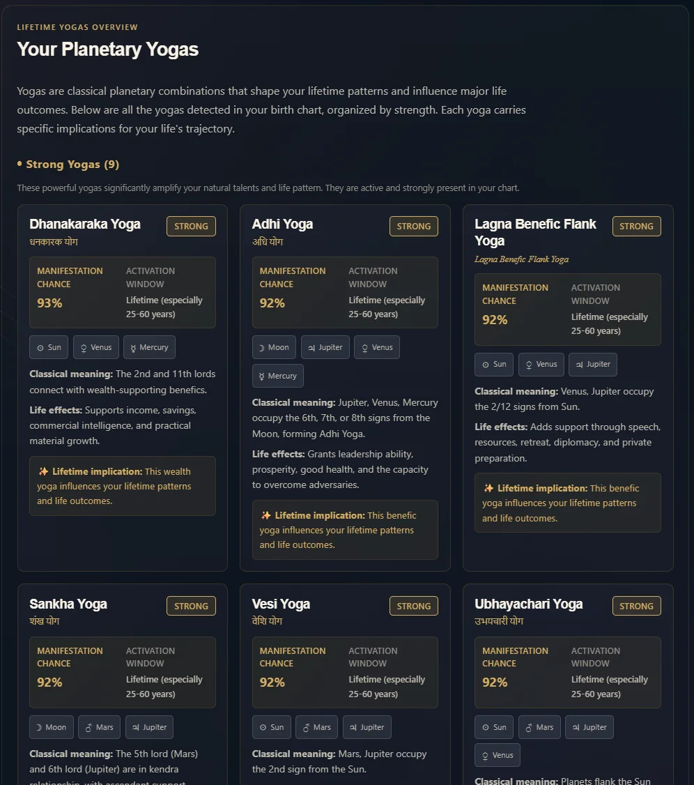
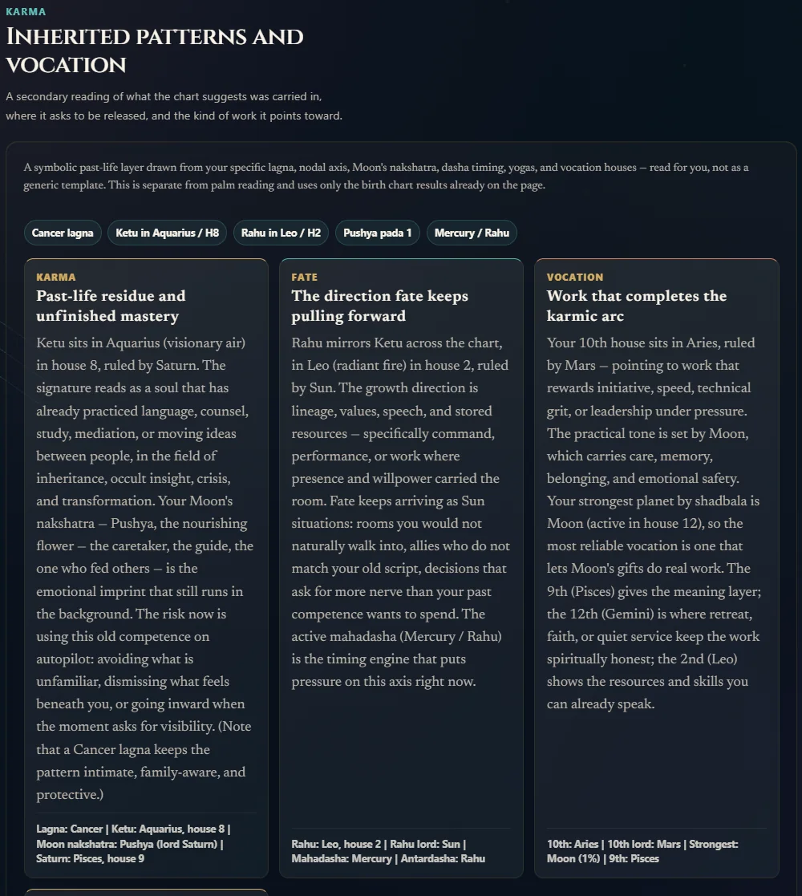
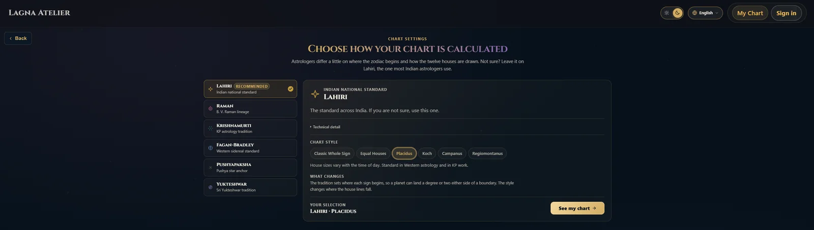

<!-- generated by scripts/build.py from data/projects.toml - edit the manifest, not this file -->

[← Back to profile](../README.md#featured-work)

# Lagna Atelier

**Vedic birth charts with AI-written interpretations**

Vedic astrology engine: birth charts across six ayanamshas and six house systems, dasha timelines, yoga detection and AI palm reading.

**1,863 tests** · **23 divisional charts** · **51 yogas detected**

**Stack:** `Next.js` `TypeScript` `astronomy-engine` `Neon + Drizzle` `Claude vision`  
**Live:** [lagnaatelier.site](https://lagnaatelier.site/)  
**Code:** [github.com/SwapnanilBala/Large_Astro_Web_App](https://github.com/SwapnanilBala/Large_Astro_Web_App)

## Screenshots (7)

<table>
<tr>
<td align="center" valign="top"> Guided onboarding: name, birth date, time and place, with a live sky preview</td>
</tr>
</table>

<table>
<tr>
<td align="center" valign="top"> Daily overview: planetary positions, top takeaways, natal chart wheel and weekly energy</td>
</tr>
</table>

<table>
<tr>
<td align="center" valign="top"> Connected Insight Zone: life-area tabs and a house-by-house support breakdown</td>
</tr>
</table>

<table>
<tr>
<td align="center" valign="top"> Vimshottari Dasha timing: current periods, calculation audit and a full timeline</td>
</tr>
</table>

<table>
<tr>
<td align="center" valign="top" width="50%"> Lifetime yogas: detected planetary combinations ranked by strength</td>
<td align="center" valign="top" width="50%"> Karma and vocation: a symbolic reading drawn from lagna, nodes, nakshatra and dasha timing</td>
</tr>
</table>

<table>
<tr>
<td align="center" valign="top"> Calculation settings: choose the ayanamsa and house system behind the chart</td>
</tr>
</table>

---

[All projects](../README.md#featured-work) · [Robust Health →](robust-health.md)
