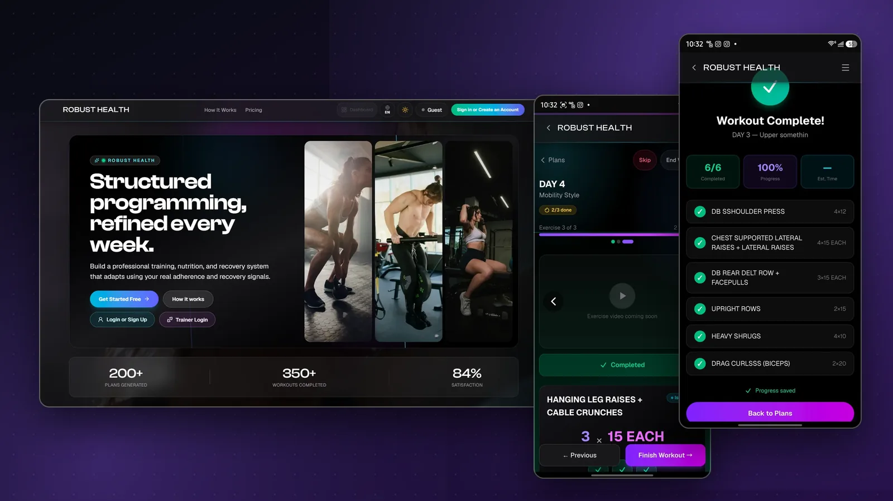
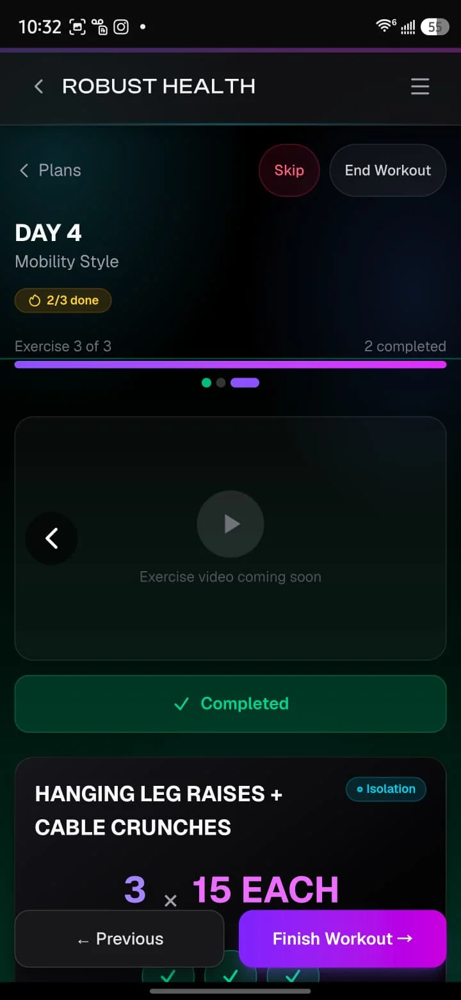
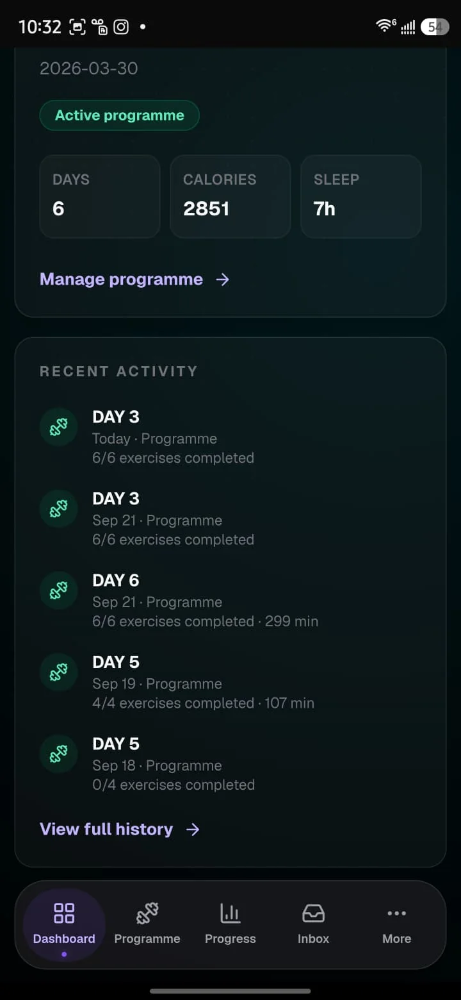
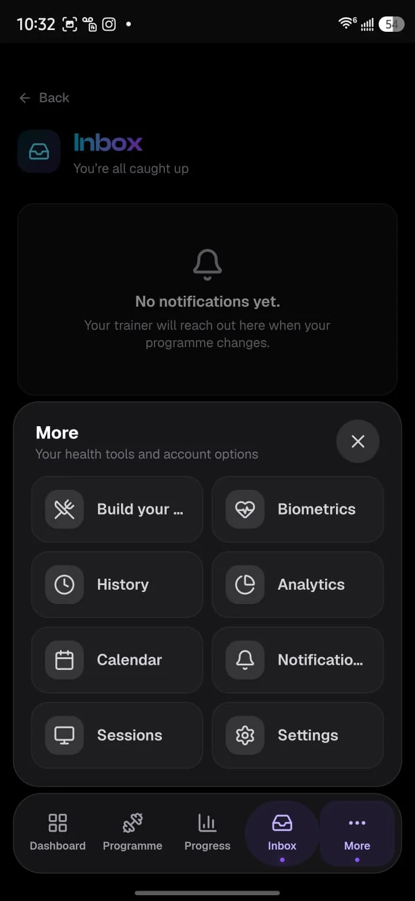
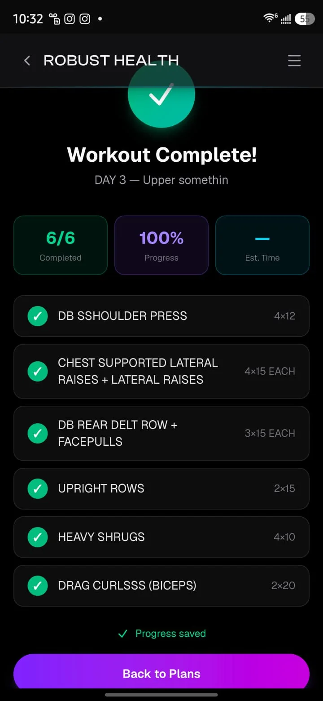
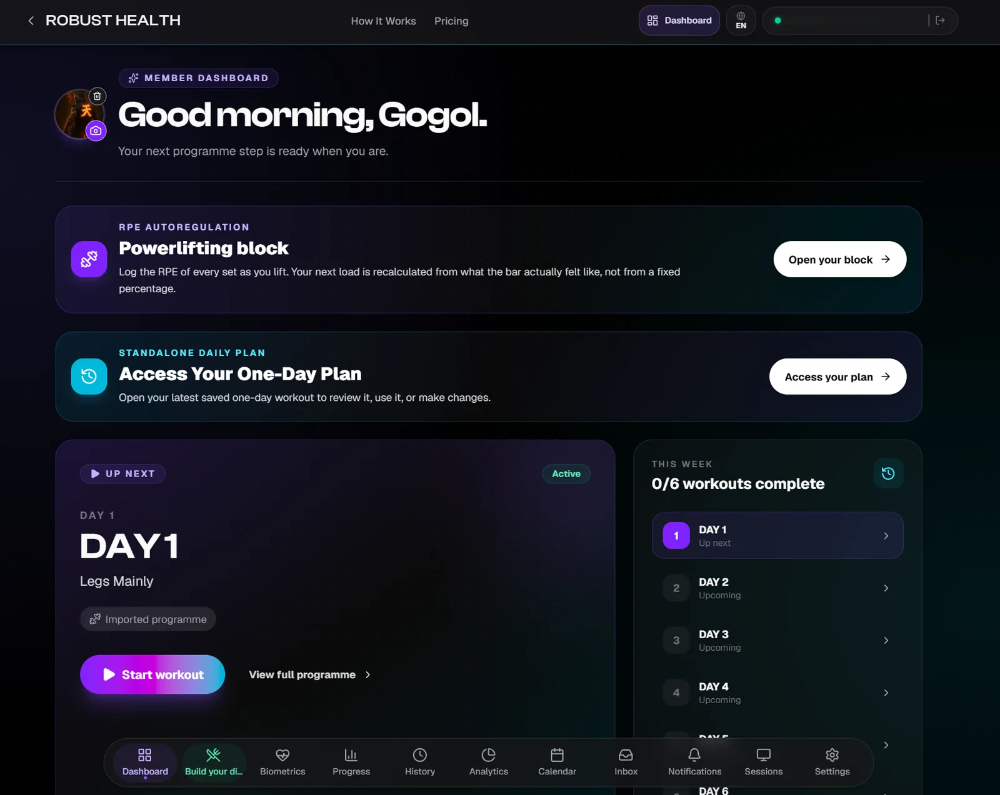
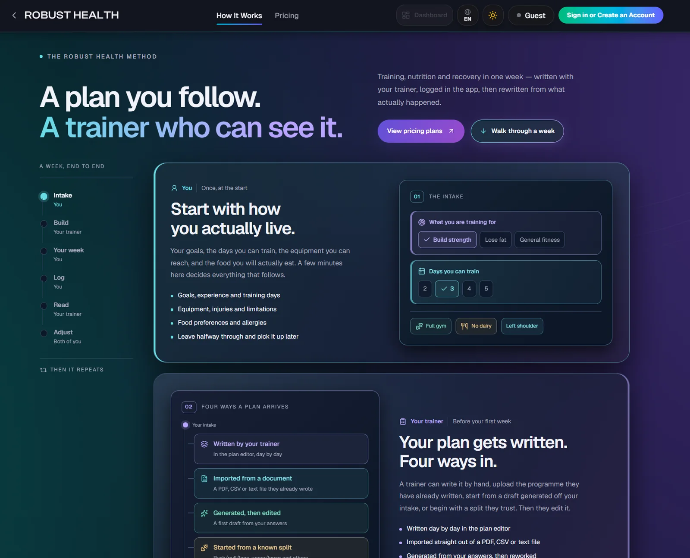
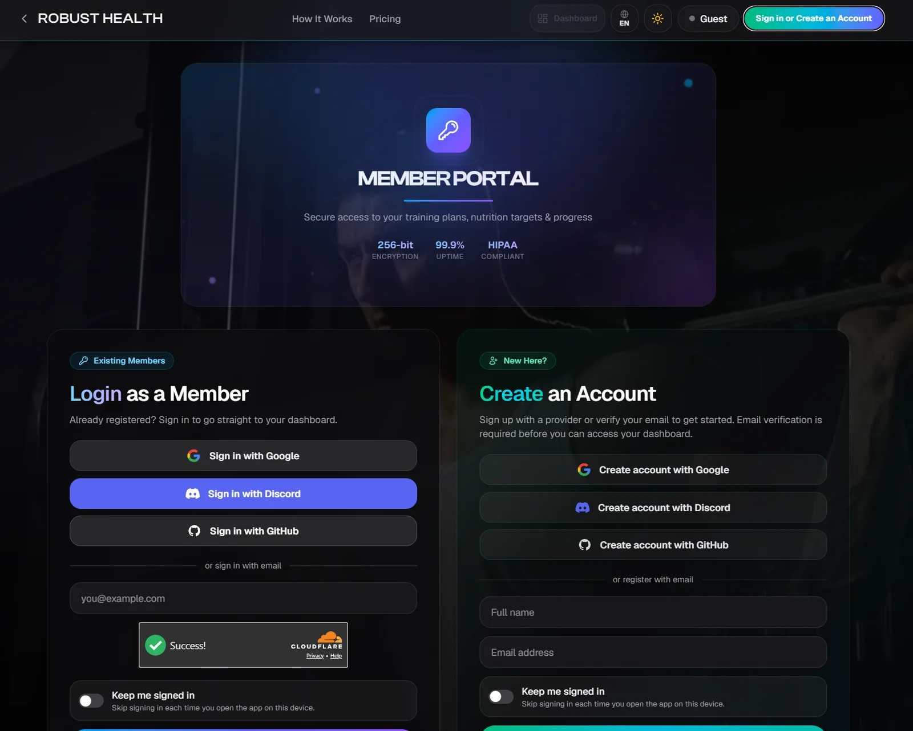
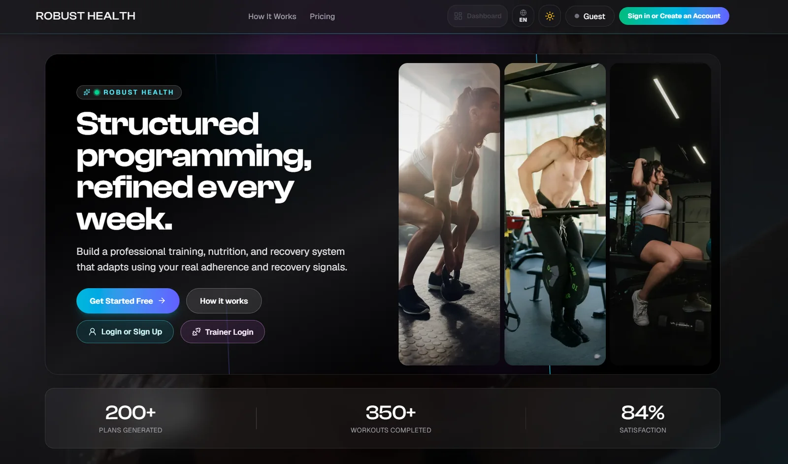

<!-- generated by scripts/build.py from data/projects.toml - edit the manifest, not this file -->

[← Back to profile](../README.md#featured-work)

# Robust Health

**Programming, tracking and nutrition in one app**

Fitness PWA that turns a member's profile into weekly training, nutrition and sleep plans, with separate member and trainer portals.

**15 training programmes** · **160+ exercises** · **−50% web load time**

**Stack:** `Next.js` `TypeScript` `Supabase` `Claude API` `Vercel`  
**Live:** [app.robusthealth.in](https://app.robusthealth.in/)

## Screenshots (8)

<table>
<tr>
<td align="center" valign="top" width="25%"> Guided workout on mobile: exercise-by-exercise flow with sets, reps and progress</td>
<td align="center" valign="top" width="25%"> Mobile dashboard: active programme, weekly stats and recent activity</td>
<td align="center" valign="top" width="25%"> Inbox and the More menu: plans, biometrics, history, analytics and calendar</td>
<td align="center" valign="top" width="25%"> Workout summary with per-exercise results</td>
</tr>
</table>

<table>
<tr>
<td align="center" valign="top" width="50%"> Web dashboard: greeting, programme overview and the day-by-day plan</td>
<td align="center" valign="top" width="50%"> Landing page: how a plan gets written and followed</td>
</tr>
</table>

<table>
<tr>
<td align="center" valign="top" width="50%"> Member portal: sign in or create an account with Google, Discord, GitHub or email</td>
<td align="center" valign="top" width="50%"> Landing hero: structured programming, refined every week</td>
</tr>
</table>

---

[← Lagna Atelier](lagna-atelier.md) · [All projects](../README.md#featured-work) · [Appointment Booking Platform →](appointment-booking.md)
